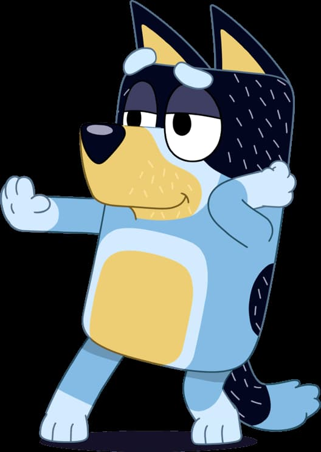

# My First Coding Assignment

## About Me

Hi 👋 My name is Matt & I'm a Web Developer by day, father and husband by night. I consider myself to be somewhat of a whiskey enthusiast. In my free time I enjoy cooking, backgammon, gardening, learning new coding languages and spending time with family. I'm looking forward to learning all that I can while completing a Master's Degree.

## Past Coding Experience

In my current role as an associate developer I work out of two different codebases: PhP and Classic ASP. Both codebases use a SQL database. We also use Bootstrap for a CSS library and jQuery for our JavaScript. The company has recently decided that they want to transition to React for all of our development. We recently had a two-day training in React to prepare us for the transition.

During my coursework at University of Massachusetts, I took courses in HTML, CSS, JavaScript, Python, C, ColdFusion, and SQL. I also took a survey of programming languages course that covered Ruby, Perl, C#, and Linux shell.

## Career Goals

1. Complete my Master's Degree
2. Advance to Senior Developer
3. Start my own freelance web development business
